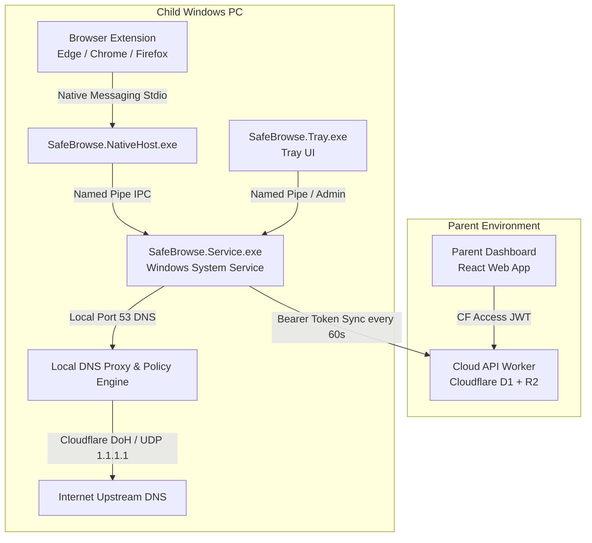

# Safe Browse Architecture & Product Design

This document outlines the product vision, core problem statement, end-to-end system architecture, privacy boundaries, tamper prevention mechanics, and ongoing architectural discussion points for **Safe Browse**.

---

## 1. Product Vision & Problem Statement

### What are we solving?
1. **Cost & Bloat of Proprietary Solutions**: Commercial tools (Net Nanny, Bark, Qustodio) charge **$50–$120/year per device**, rely on bloated desktop software, install invasive root TLS certificates to inspect private messaging/content, and sell user data.
2. **Easy Bypasses**: Children under 18 routinely bypass traditional parental controls by changing system DNS servers, enabling browser DNS-over-HTTPS (DoH), or installing free VPN extensions/apps.
3. **Privacy-First Family Model**: Parents want to block harmful content (Adult, Gambling, Drugs, Malware, Social Media during school hours) and monitor top-level domain activity **without spying on page content, search terms, or private messages**.

### Target Audience & Scope
- **Target Audience**: Small nuclear families (**< 10 devices/users** per household).
- **Zero-Cost Operating Model**: Architecture designed so a family can host the backend on Cloudflare’s free tier ($0/month) or run a simple local container.
- **Device Radius**:
  - **MVP Scope**: Windows 10 & 11 PCs (standard non-admin child accounts).
  - **Future Radius**: Mobile (iOS & Android) and macOS.

---

## 2. End-to-End System Architecture

Safe Browse is split into **4 primary layers**:

---

## 3. Deep-Dive into the Core Layers

### Layer A: Cloud Backend (`apps/worker`)
The backend is a lightweight, serverless API built on Cloudflare Workers, Edge D1 (SQLite), and R2 (object storage).

- **Parent Routes (`/api/v1/parent/*`)**:
  - Protected by **Cloudflare Access JWT** (verifies issuer, audience, and email).
  - Handles household creation, child profiles, real-time policy updates, time schedules, and approving/rejecting access requests.
  - Generates 6-digit single-use enrollment codes valid for 10 minutes.
- **Device Routes (`/api/v1/device/*`)**:
  - Protected by opaque 256-bit bearer tokens (stored in D1 as SHA-256 hashes).
  - **`/enroll`**: Exchanges a 6-digit code for a permanent device ID, encrypted token, and initial policy.
  - **`/sync`**: Devices poll every 60 seconds (`policyVersion` & `listVersion`). Returns `304 Not Modified` if policy has not changed.
  - **`/events`**: Uploads batched domain navigation and block events with idempotency keys.
  - **`/lists/manifest` & `/lists/:version/:file`**: Delivers compressed category blocklists (`.txt.gz`) signed with ES256 private keys.

---

### Layer B: Windows Local Agent (`apps/windows`)
The Windows agent operates as an autonomous background service (`NT AUTHORITY\SYSTEM`). **It continues enforcing rules even if the cloud or internet connection is completely offline.**

1. **Local DNS Proxy (`127.0.0.1:53`)**:
   - Listens on loopback UDP and TCP port 53.
   - Every system DNS query is parsed and evaluated against local in-memory policy.
   - If **Allowed**: Resolves upstream via Cloudflare DoH (`https://cloudflare-dns.com/dns-query`) with automatic UDP fallback to `1.1.1.1:53`.
   - If **Blocked**: Immediately returns `NXDOMAIN` (0-byte DNS response).
2. **Local Policy Engine (`PolicyEvaluator.cs`)**:
   - **Domain Rules**: Custom domain allow/block lists (`blocked-test-domain.com` → `NXDOMAIN`).
   - **Category Blocklists**: In-memory `HashSet<string>` loaded from compressed `*.txt.gz` files (Adult, Gaming, Gambling, Anime, etc.). Lines starting with `#` comments are ignored.
   - **Time Schedules**: Category schedules evaluated against the child's local timezone (e.g., block Gaming between 21:00 and 07:00).
   - **Internet Pause**: Master toggle to block all non-essential internet access.
   - **Unenrolled Default**: Allows DNS traffic by default until enrolled with a family account.
3. **Named Pipe IPC (`\\.\pipe\safe-browse-native`)**:
   - ACL-restricted named pipe (SYSTEM, Administrators, Authenticated Users).
   - Handles IPC commands from the Browser Extension and System Tray:
     - `{"action":"evaluate","domain":"..."}`
     - `{"action":"navigation","domain":"...","browser":"..."}`
     - `{"action":"request","domain":"...","category":"...","reason":"..."}`
     - `{"action":"emergency"}` (Requires Windows Administrator token; grants 15-minute emergency bypass).
4. **Credential Protection**:
   - Device bearer token is encrypted at rest using machine-scoped DPAPI (`ProtectedData.Protect`) at `C:\ProgramData\SafeBrowse\device.credential`.

---

### Layer C: Network Hardening & Prevention (`configure-protection.ps1`)
To prevent children from bypassing local DNS:
1. **System DNS Redirection**: Sets active interface DNS servers to `127.0.0.1` and `::1`.
2. **Browser DoH Neutralization**: Sets Registry / Group Policy keys (`DnsOverHttpsMode = off`) for Chrome, Edge, and Firefox so browsers cannot bypass port 53.
3. **Outbound Firewall Blocking**: Windows Firewall blocks outbound UDP/TCP 53 and 853 for all processes **except `SafeBrowse.Service.exe`**.

---

### Layer D: Extension & Native Host (`apps/extension` & `SafeBrowse.NativeHost`)
- **Native Host CLI (`SafeBrowse.NativeHost.exe`)**: Acts as a bridge between browser extensions and the background Windows service via standard I/O (4-byte length header + JSON) to Named Pipe relay.
- **WebExtension**:
  - Telemetry: Reports top-level hostname navigation to the service.
  - User Interface: Shows a clean block page when a domain is blocked, featuring a **"Request Access from Parent"** form.

---

## 4. Trust Boundaries & Privacy Boundaries

- **Strict Telemetry Boundary**: The MVP deliberately records only top-level hostnames and blocked DNS attempts. It never collects page paths, query strings, page titles, or page content.
- **Access Verification**: Parent routes require a Cloudflare Access JWT whose issuer and audience are verified by the Worker.
- **Device Credential Hash**: Device routes use opaque 256-bit bearer tokens. D1 stores only SHA-256 token hashes.
- **Single-Use Enrollment**: Enrollment codes are random, single-use, stored as hashes, and expire after ten minutes.
- **Artifact Signing**: R2 blocklist artifacts are delivered through authenticated device routes and verified against a signed ES256 manifest.
- **Extension Decoupling**: The browser extension provides presentation and navigation telemetry only. Disabling or removing the extension does not bypass DNS enforcement.

---

## 5. Architectural Summary Table

| Component | Technology | Primary Role | Bypassed easily? |
| :--- | :--- | :--- | :--- |
| **Worker Backend** | Cloudflare Worker + D1 + R2 | Parent control, sync, event storage, signed lists | No (Cloudflare Access JWT + Token hashes) |
| **Windows Service** | C# .NET 8 Worker Service | DNS proxy (`127.0.0.1:53`), policy evaluator, pipe host | No (Runs as SYSTEM on non-admin child account) |
| **Native Host** | Native C# Executable | StdIO-to-Pipe relay for browser extensions | No (Scoped to named pipe ACL) |
| **Browser Extension** | WebExtension Manifest v3 | Top-level domain telemetry, block UI | DNS proxy handles enforcement even if extension is disabled |
| **Hardening Script** | PowerShell | DNS lock, firewall rules, browser DoH override | Reverts cleanly on uninstall |

---

## 6. Open Discussion Points for Next Architectural Iterations

1. **Mobile Radius Expansion Strategy**:
   - **iOS**: Generated `.mobileconfig` profile (specifying DNS-over-HTTPS / DoH endpoint) vs. custom `NetworkExtension` app.
   - **Android**: Native Private DNS feature pointing to a per-child DoH endpoint (`https://family.example.com/dns-query/:childToken`) vs. local `VpnService`.
2. **Cloud vs. Local Self-Hosting**:
   - Cloudflare Worker (D1/R2) as default cloud stack vs. single `docker-compose.yml` for local home server / NAS deployment.
3. **Multi-User Windows PC Scenarios**:
   - Supporting active Windows user session SIDs to apply different age bands for siblings sharing the same PC.
